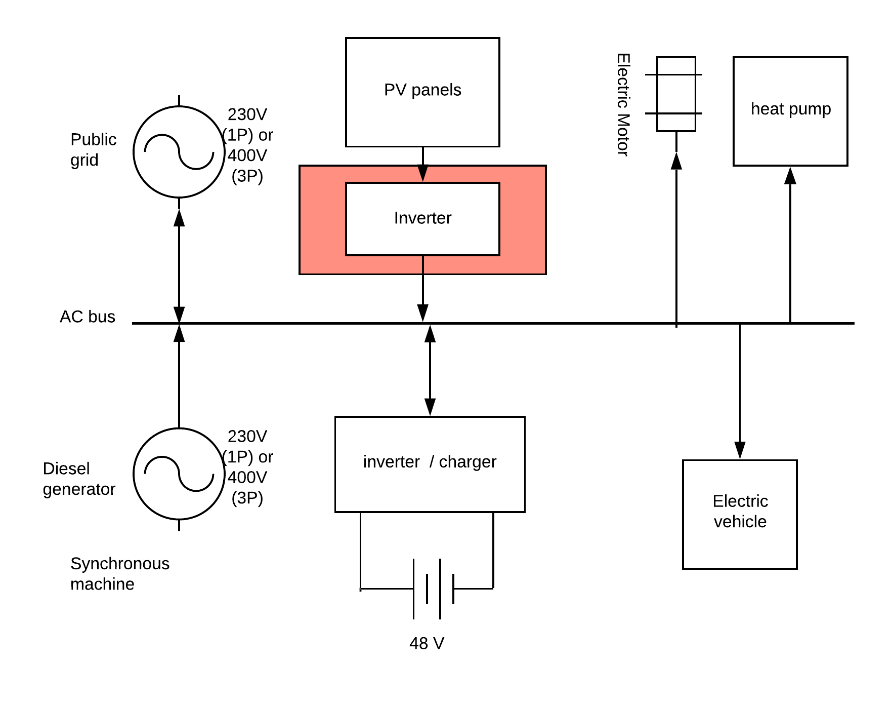
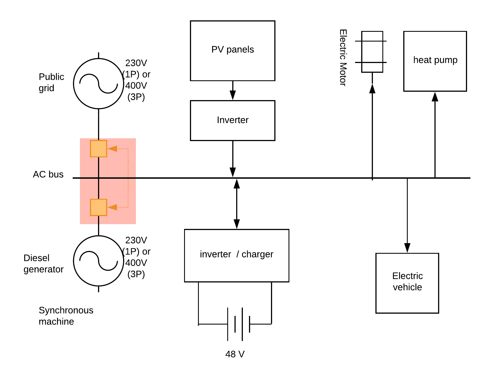
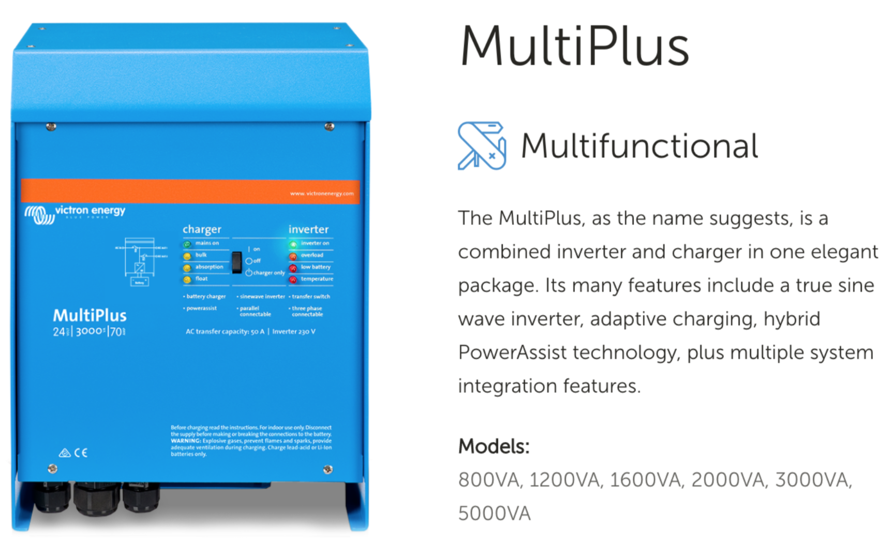
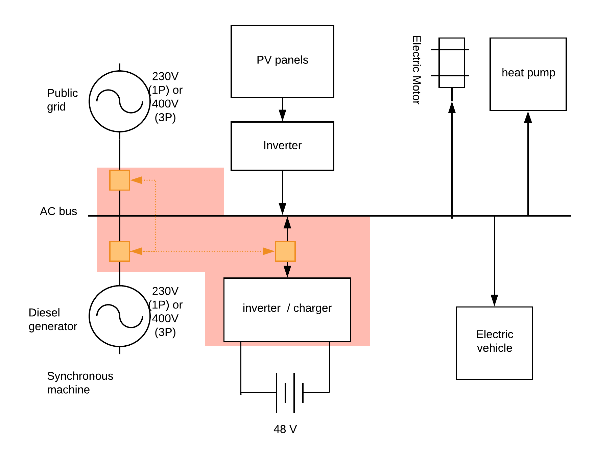
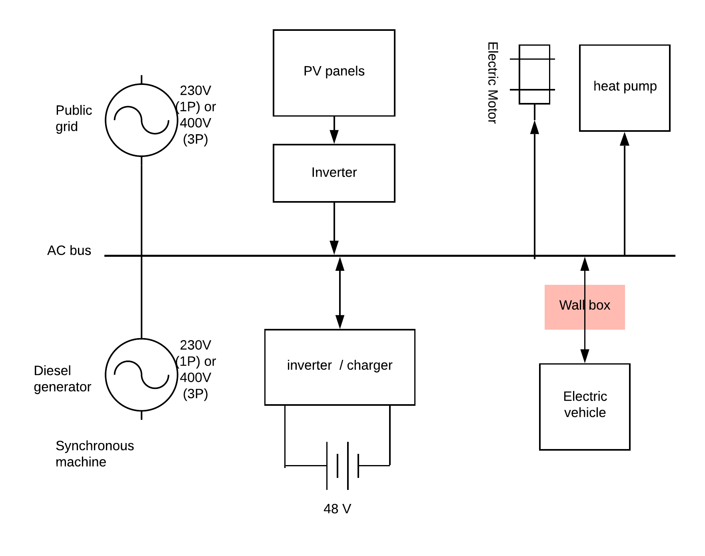
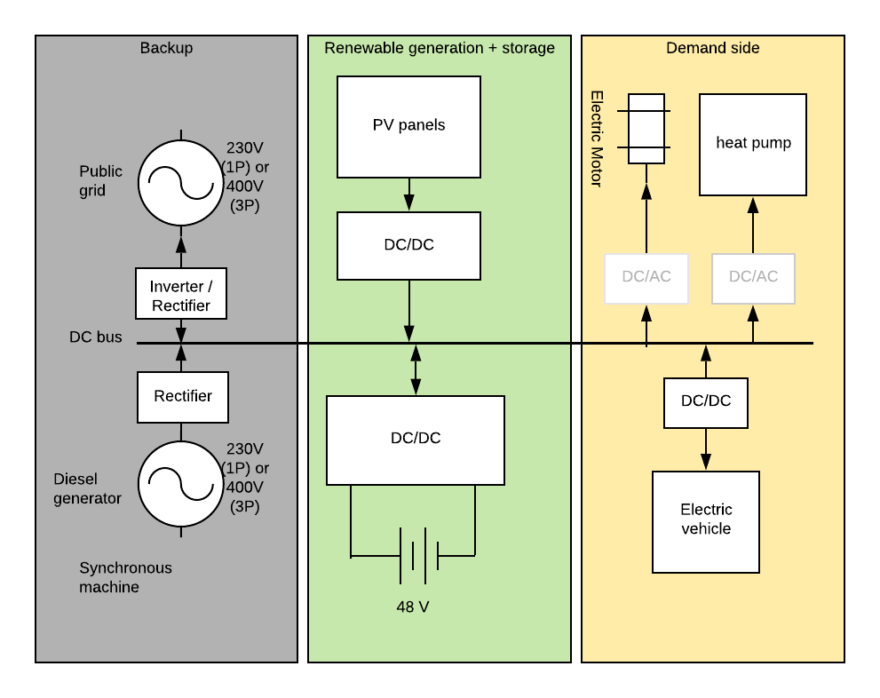

class: middle, center, title-slide
count: false

# Microgrids

Microgrid architectures

  

Bertrand Cornélusse 
[bertrand.cornelusse@uliege.be](mailto:bertrand.cornelusse@uliege.be)

---

## Content of this lecture

In this lecture we review microgrids architectures, that is which components form a microgrid and how to interconnect them.

In the next lectures we will focus on the components themselves, on features that are
important for operation, both from a technical point of view and from an economical point of view.

---

# AC grids

An alternating current (AC) microgrid is a microgrid where components are coupled through one AC bus (if there is only one voltage level).

- Most microgrids are AC
- Typically, AC microgrids where the demand > 5kW are three-phase!
 - Required if you want to connect to the public grid (in Belgium)
 - Equipments in general require less components per unit of power transferred
 - Easy to generate a rotating field for motors
 - (Three-phase power transfer is a constant expression, if the phases are balanced)
 
---

## AC coupling example

Let's take the example of a house or a small company that is running at low-voltage (230V or 400V) and has a grid connection plus a backup diesel generator, some PV panels, a battery, and some appliances.

.center.width-80[]

---

## Grid topologies

Most common: radial architecture
 - Subject to availability issues (one single path to a load)

Alternatives:
 - provide a redundant path to each load
 - provide spatially diverse paths
 - ring-type distribution
 - ladder type distribution

---

# Power electronics interfaces

Power electronic circuits are interfaces
- between devices (DERs and loads) and the power distribution grid
- between the microgrid and the distribution grid (PCC)

Purpose: enable a controllable (bidirectional) flow between devices

 - They are either *grid-forming* or *grid-following*. In general, there is only one grid-forming device at a time, else some coordination is necessary.

*DER: sources of electric power that are not directly connected to a bulk power transmission system. Distributed energy resources include both generators and energy storage technologies. (T.Ackermann, G.Andersson, and L.Söder, “Distributed Generation: A Definition,” Electric Power Systems Research, vol. 57, issue 3, April 2001, pp. 195–204.)

---

## Solar inverter

.grid[
.kol-1-2[.width-100[]]
.kol-1-2[.width-100[]]
]
Here it is a three-phase inverter from SMA.
Source: website of SMA

Requires a network signal to work!

---

## Automatic transfer switches

.width-100[]

---

class: middle, center, black-slide

<iframe width="600" height="450" src="https://www.youtube.com/embed/883JgMK9EGg" frameborder="0" allowfullscreen></iframe>
Automatic transfer switch principle

---

## Automatic transfer switch, grid forming inverter & battery charger

.grid[
.kol-1-2[.width-100[]]
.kol-1-2[.width-100[]]
]
Source: website of Victron.

---

## Vehicle to grid

.width-100[]

---

class: middle, center, black-slide

<iframe width="600" height="450" src="https://www.youtube.com/embed/5FAsadUM26I" frameborder="0" allowfullscreen></iframe>

---

## Characterizing power distribution architectures based on how power conversion is performed

- Centralized: power conversion is performed at a single power electronic interface
- Distributed: power conversion functions are spread among converters
 - may lead to parallel or cascade structures

---

# Grid-forming inverter

TODO

- Frequency control
- Synchronisation (PLL)
- If connected to a battery, means that the battery follows the residual between generation and demand.

---

# Grid-following inverter

TODO

- If connected to a battery, means that the battery is controllable, i.e. can absorb or deliver power dependeing on a setpoint.
- Of course also depending on the availability of generation / demang and of another device to regulate the imbalances.

---

class: middle, center

# Rules for connecting DER to the grid (Belgian case, C10/11)

---

TODO

---

class: middle, center

# DC microgrids

---

## DC microgrids

- The distribution system is DC
 - Requires DC to DC converters to adapt voltage to devices
 - DC to AC to power AC loads, or to inject in the public grid
 - AC to DC to convert AC generation to DC (e.g. from public grid to microgrid)
- DC microgrids are not widespread but gain some interest

---

## DC microgrid example

.width-100[]

---

## DC vs AC: pros

.grid[
.kol-1-2[.center[:)]
- DC systems enable a simpler integration of distributed energy resources (DERs*), since many of them are either DC by nature or require a DC interface anyway
- Parallel distributed architectures are simpler to realize in DC:
 - unnecessary frequency control and phase synchronization
- Frequency control is not necessary in DC systems
 - unwanted harmonic content may by easier to filter too]
.kol-1-2[.center[:(]
- Autonomous distributed control harder in DC than in AC because no information carried through the signal (frequency, phase)
- There are stability issues due to DC-DC conversion stages
- It is more difficult to clear fault currents: the signal “does not go through zero”. Hence protections are more costly and harder to set up.]
]

---

## E.g. Studer-innotec VarioString series

Do I keep it?

Source: website of Studer-innotec

---

## Exemple 1 from Studer

TODO

---

## Exemple 2 from Studer

TODO

---
class: middle, center
## Off grid case design

---

# Parts

- Solar charge controller (30 A)
- PV panel
- Battery
- Inverter (1500 W)

- Buses
- cables: 
 - inverter DC side: < 1m, 25 $mm^2$, up to 160 A (1920 VA)
 - solar charge controller, 1m, 6 $mm^2$, up to 40 A

- Fuses:

---

# References

- Kwasinski, Alexis, Wayne Weaver, and Robert S. Balog. Microgrids and other local area power and energy systems. Cambridge University Press, 2016.

---

class: end-slide, center
count: false

The end.
