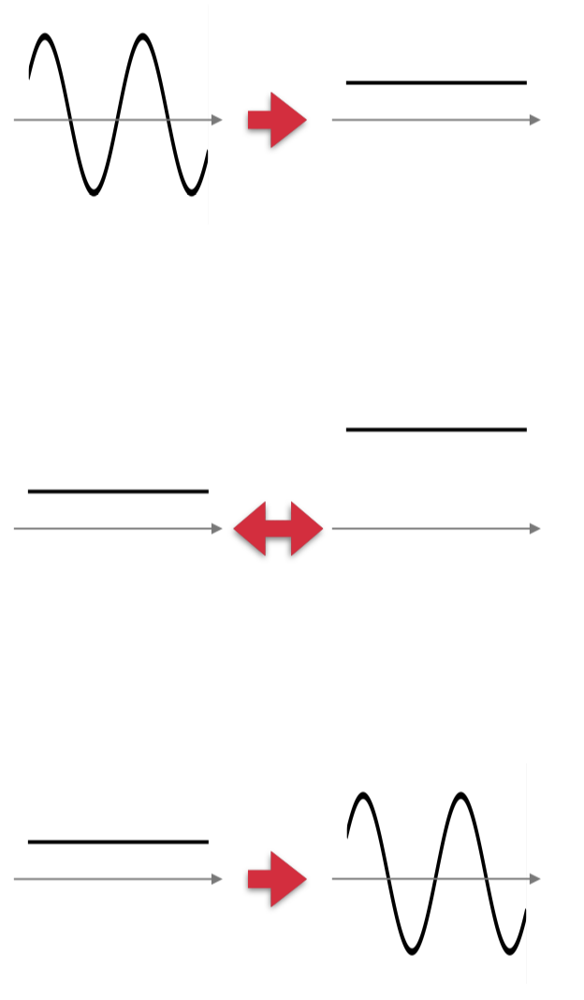
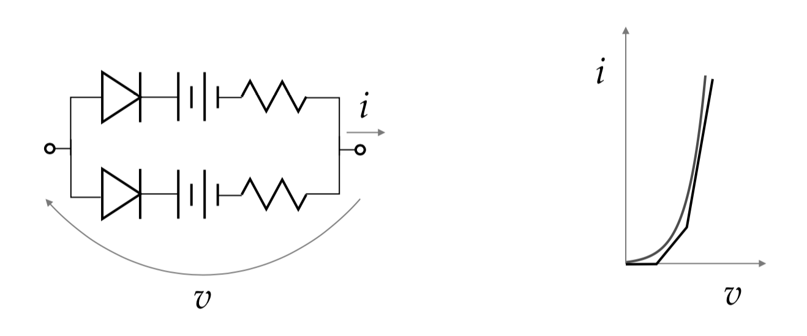
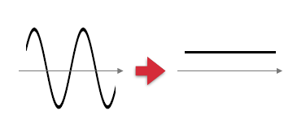
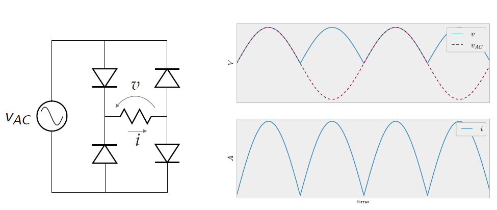
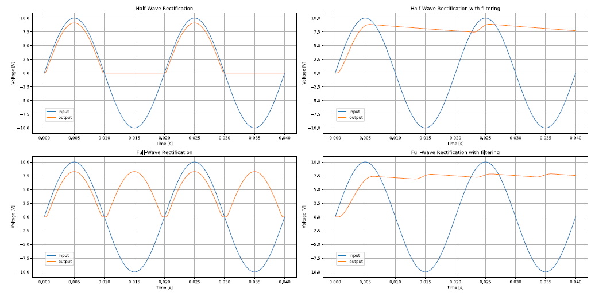
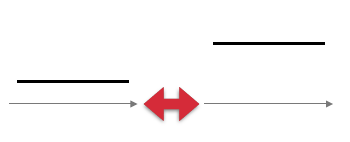
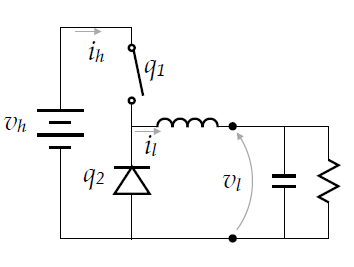
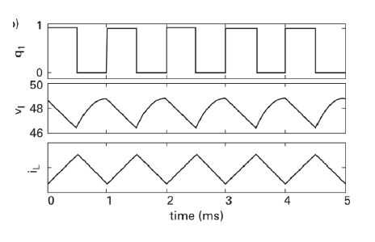
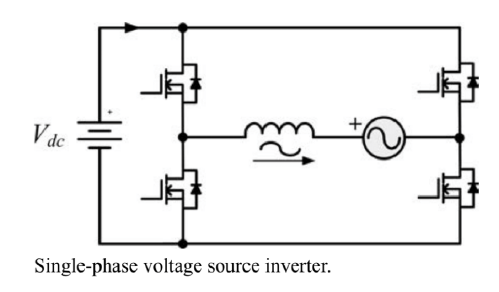
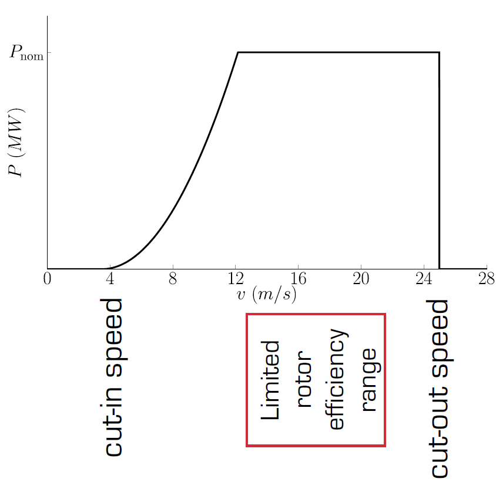

class: middle, center, title-slide
count: false

# Microgrids

Microgrid power sources and power electronics interfaces

  

Bertrand Cornélusse 
[bertrand.cornelusse@uliege.be](mailto:bertrand.cornelusse@uliege.be)

---

## Content of this lecture

In this lecture we review 
- the main types of components that can be used as sources in microgrids
- their power electronics interfaces

---

class: middle, center
# Power electronics interfaces

---

## 3 main categories of power electronics devices

.grid[
.kol-1-2[
- Rectifiers: AC to DC, are typically used at the output of small wind turbines or micro-turbines    
- DC-DC converters e.g. to interface photovoltaic modules and achieve their maximum power operating point    
- Inverters: DC to AC e.g. to connect PV modules to the AC distribution grid
]
.kol-1-2[.width-80[]]
]

---

## The main components of power electronics devices

  

.center.width-80[**Controllable switches that can be actuated at a high frequency, without excessive losses, and with a large lifetime**]

  

.grid[
.kol-1-2[
Ideal switch model:
- no losses
- switches without delay
]
.kol-1-2[.width-100[]]
]

---

## Realistic switch model
   
.center.width-50[]

---

## Diode models: ideal diode

.center.width-80[]

- Current flows from anode to cathode when forward biased: $i>0 \Rightarrow v=0 $
- No current when reversed bias: $v<0 \Rightarrow i=0$

---

## Diode models: realistic diode in the forward bias region

.center.width-80[]

Piecewise linear approximation of “true exponential model”.

---

## Thyristors

.center.width-20[]

Thyristors are “controllable diodes”, through a gate where a signal is applied

Different types:
- GTO (gate turn off) can be turned on and off, less than 1kHz switching frequency
- SCR (silicon-controlled rectifier): can be turned on, turns off when forward current goes through zero
- TRIAC (Triode alternating current): two SCR back to back with one gate (AC-AC conversion)

---

## Transistors

- Bipolar junction transistors (BJT)
 - Historically used as amplifiers in their active region of operation
 - Can also be used as a switch, in the saturation region
 - High power, but high losses
- Field effect transistors (MOSFET)
 - High speed and high efficiency at low voltage.
 - Isolated gate (field effect)
 - Commonly used for low voltage converters

---

## Insulated Gate Bipolar Transistor (IGBT)

- Most common device for high power DC-DC converters and inverters from medium to high voltages
- Combination of BJT and MOSFET
- Now replaces thyristors in most medium to high power applications

---

# Characterization of power electronics devices

*DC component*: 
- Integral of the output signal over a full AC input cycle.
- In case of a rectifier, this is the power that is really transmitted from source to load.

--

*Total Harmonic Distortion*:
THD = ratio of the total signal, including harmonics, to the desired frequency component:

$$THD = \sqrt{\frac{F^2\_{RMS}-F^2\_{RMS,1}}{F^2\_{RMS}}}$$

IEEE standard 519–1992, “Recommended Practices and Requirements for Harmonic Control in Electrical Power Systems”, states that the voltage THD is limited to 5% for general systems and is only up to 20% for dedicated systems

---

# Rectifiers
.center.width-30[]

Rectifiers: large subclass of topologies for AC to DC conversion
- Single-phase or three phase voltage source to DC current load
- Power-electronic is “only” the front end: 
 
 
.center.width-100[]

---

## Half bridge single phase topology

.center.width-90[]

DC component: $V\_{DC} = \frac{V_p}{2 \pi} \int_0^\pi \sin(t) dt = -\frac{V_p}{2 \pi} \cos(t)|\_0^\pi = \frac{V_p}{\pi}$

---

## Full-bridge single phase topology

.center.width-90[]

- DC component twice of the half bridge
- But Large harmonic current in the input AC current
- DC output not controllable

---

## Full-bridge single phase topology *with low pass filter*

.center.width-90[]

- Improves output harmonics content
- Better if capacitor size increases
 - which in turn degrades harmonic content of input
- Bad power factor => LC topology
- Active power factor correction => DC-DC after the rectifier

---

## Recap with more realistic components

.center.width-100[]

---

# DC - DC converters

.center.width-30[]

- DC-DC converters are present in many devices,
 - from mW power level to MW level
- Made possible by MOSFET and IGBTs
- Can be unidirectional, from low voltage to high voltage or the inverse, or bidirectional
 - $v\_h > v\_l$, $i\_l>i\_h$

---

## Basic bloc: two switches

.center.width-100[]

Only one switch ON at a time! 

---

## Pulse Width Modulation (PWM)

- Process that actuates the switches
- Duty cycle signal compared to a reference triangular waveform of a chosen frequency

.center.width-80[]

---

## Converter types

.grid[
.kol-1-2[*BUCK*

q1 is a controllable switch and q2 is a diode
.center.width-80[]
.center.width-80[]]
.kol-1-2[*BOOST*

q2 is a controllable switch and q2 is a diode
.center.width-80[]
.center.width-80[]]
]

---

# Inverters

.center.width-30[]

- Voltage source inverter: $v\_{AC} < v\_{DC}$
- Current source inverter: $v\_{AC} > v\_{DC}$
- Impedance source inverter : for a wide variation of $v\_{AC} \leq v\_{DC}$

.center.width-50[]

---

class: middle, center
# Power generation sources

---

# Wind turbines

- Wind turbines convert the mechanical power of wind into electrical power.
- The power of the wind can be derived from its kinetic energy
  $$ E_w = \frac{1}{2} m v^2$$ 
  As power is the time derivative of energy, we have, assumming the speed is constant:
  $$P_w = \frac{dE_w}{dt} = \frac{1}{2} \frac{dm}{dt} v^2$$
   And
  $\frac{dm}{dt} = \rho A v$ with $A$ the area crossed by the wind,
  and $\rho$ is the mass of air by unit of volume. This yields
  $$ P_w = \frac{1}{2} \rho A v^3 $$

---

## Power conversion

 Only a fraction of the wind power is harvested by the blades.
Actually, the energy harvested is function of the speed of the air
  that enters the blades, $v_u$, and speed of the air that leaves the
  blades, $v_d$: $$P_b = \frac{1}{2} \frac{dm}{dt}(v_u^2 - v_d^2)$$

Approximating $\frac{dm}{dt}$ by $\rho A \frac{v_u-v_d}{2}$ and
defining the coeffitient $\lambda_w$ as
$$ \lambda_w = \frac{v_d}{v_u} $$

Then the power harvested by the turbine can be written as
$$P_b = \frac{1}{2} \rho A \frac{v_u - \lambda_w v_u}{2} (v_u^2 - \lambda_w^2 v_u^2)$$

---

## Turbine efficiency

If we define the coefficient
$$ C_p = \frac{1}{2} (1+\lambda_w) (1-\lambda_w^2)$$ Then
$$P_b = \frac{1}{2} C_p \rho A v_u^3$$

*Betz limit*:

- It can be shown that there is a theoretical limit for $C_p$ at
  $$\frac{16}{27} = 59.2\%$$
- This limit is reached for $\lambda_w = 1/3$.

---

## Efficiency of different technologies as a function of tip-speed ratio (TSR)

.center.width-80[]

TSR = rotor tip speed / wind speed.

---

## Electromechanical conversion
So far, we have only been talking about mechanical power conversion!

Several types of generators can be used to convert mechanical power into electrical power:
- Synchronous machine
- DC machine
- Induction machine
- Doubly fed induction machine

Brushless variants of (some of) these machines can be used to decrease maintenance needs, through permanent magnets. Those cannot be used for large size generators (> several hundreds of kW).

---

## Power electronics interface

Most of the time, and especially in microgrids operation, these generators are coupled with power electronics to generate power with an appropriate shape:
- the output of the generator goes through a DC convertion
stage (rectifier if AC generator, DC-DC if DC generator) to
cope with wind speed variations
- if the distribution grid is AC, then there is an additional
inverter stage.

Power electronics are also used
- to maximize the energy harvested, especially for low-to-medium
power generators (instead of adapting rotor speed through
e.g. controlling blade pitch):
- to limit the power output at high wind speeds to avoid
degradation

---

## Wind generator operating characteristic

.center.width-80[]

---

# Photovoltaic generation

A PV cell is composed of semiconductor material. Photons emitted by the sun interact with the semiconducting material in two ways:
1. photons directly transmit energy to electrons and allow them to move into the conduction band.
2. a thermally generated current as in a p-n junction (diode).

---

class: middle, center
# Implementing a solar MPPT algorithm

---

## Assignment

By teams of 2, 

---

# References

- Kwasinski, Alexis, Wayne Weaver, and Robert S. Balog. Microgrids and other local area power and energy systems. Cambridge University Press, 2016.

---

class: end-slide, center
count: false

The end.
