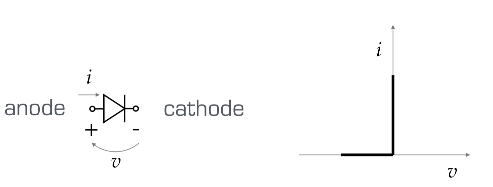

class: middle, center, title-slide
count: false

# Microgrids

Microgrid power sources and power electronics interfaces

  

Bertrand Cornélusse 
[bertrand.cornelusse@uliege.be](mailto:bertrand.cornelusse@uliege.be)

---

## Content of this lecture

In this lecture we review 
- the main types of components that can be used as sources in microgrids
- their power electronics interfaces

---

class: middle, center
# Power electronics interfaces

---

## 3 main categories of power electronics devices

.grid[
.kol-1-2[
- Rectifiers: AC to DC, are typically used at the output of small wind turbines or micro-turbines    
- DC-DC converters e.g. to interface photovoltaic modules and achieve their maximum power operating point    
- Inverters: DC to AC e.g. to connect PV modules to the AC distribution grid
]
.kol-1-2[.width-80[]]
]

---

## The main components of power electronics devices

  

.center.width-80[**Controllable switches that can be actuated at a high frequency, without excessive losses, and with a large lifetime**]

  

.grid[
.kol-1-2[
Ideal switch model:
- no losses
- switches without delay
]
.kol-1-2[.width-100[]]
]

---

## Realistic switch model
   
.center.width-50[]

---

## Diode models: ideal diode

.center.width-80[]

- Current flows from anode to cathode when forward biased: $i>0 \Rightarrow v=0 $
- No current when reversed bias: $v<0 \Rightarrow i=0$

---

## Diode models: realistic diode in the forward bias region

.center.width-80[]

Piecewise linear approximation of “true exponential model”.

---

## Thyristors

.center.width-20[]

Thyristors are “controllable diodes”, through a gate where a signal is applied

Different types:
- GTO (gate turn off) can be turned on and off, less than 1kHz switching frequency
- SCR (silicon-controlled rectifier): can be turned on, turns off when forward current goes through zero
- TRIAC (Triode alternating current): two SCR back to back with one gate (AC-AC conversion)

---

class: middle, center
# Power generation sources

---

class: middle, center
# Implementing a solar MPPT algorithm

---

## Assignment

By teams of 2, 

---

# References

- Kwasinski, Alexis, Wayne Weaver, and Robert S. Balog. Microgrids and other local area power and energy systems. Cambridge University Press, 2016.

---

class: end-slide, center
count: false

The end.
