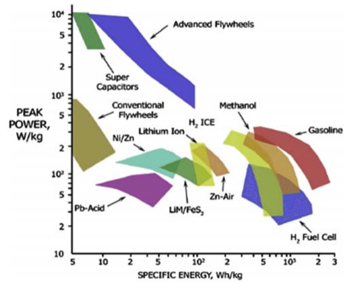
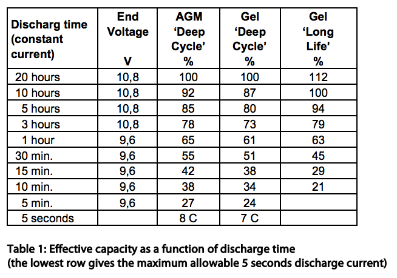
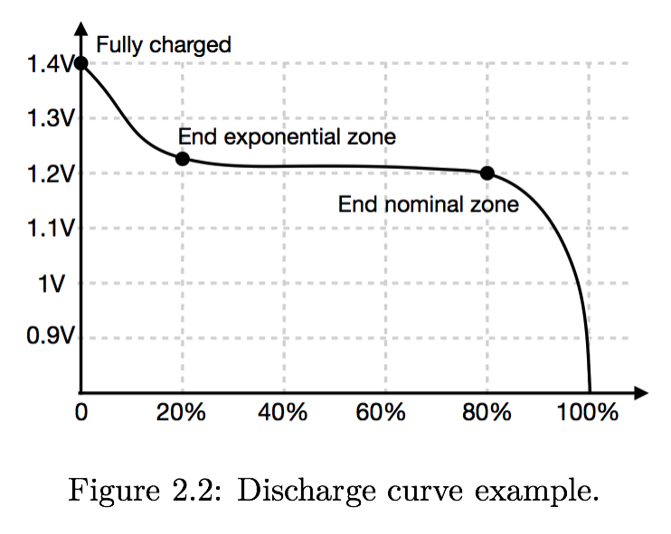
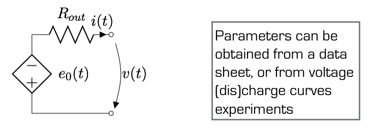
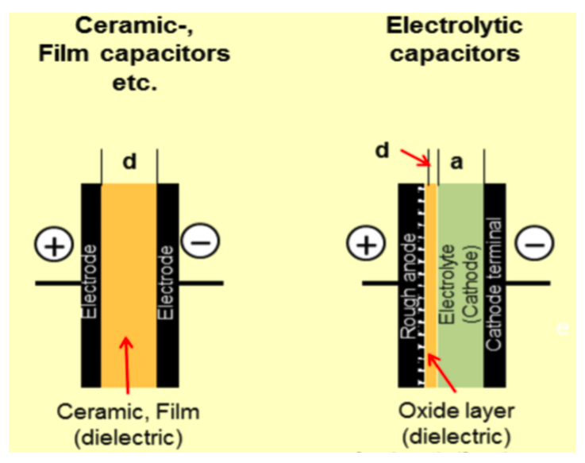
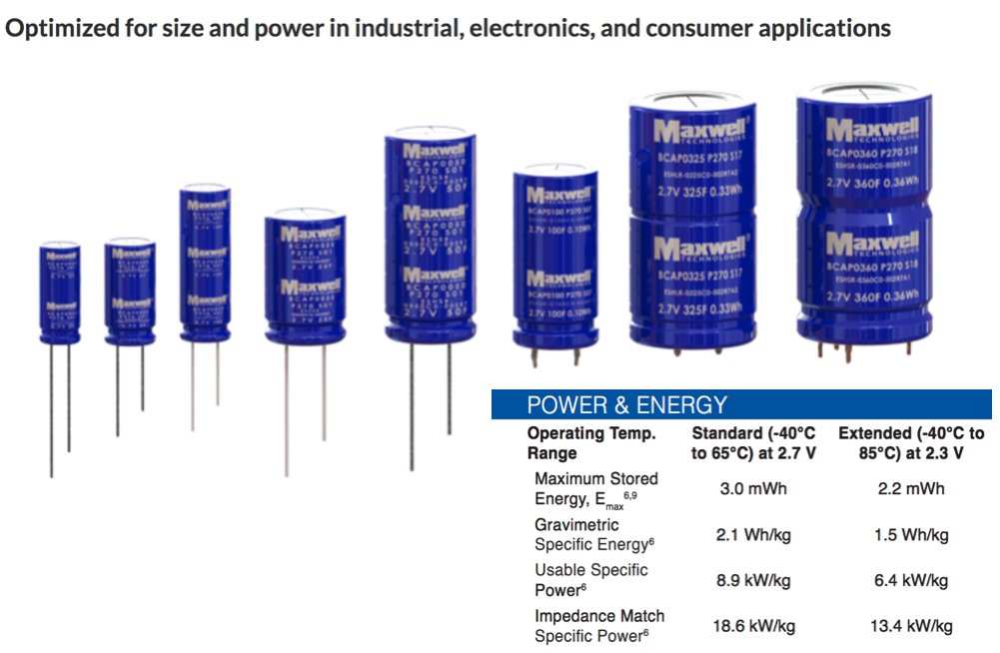
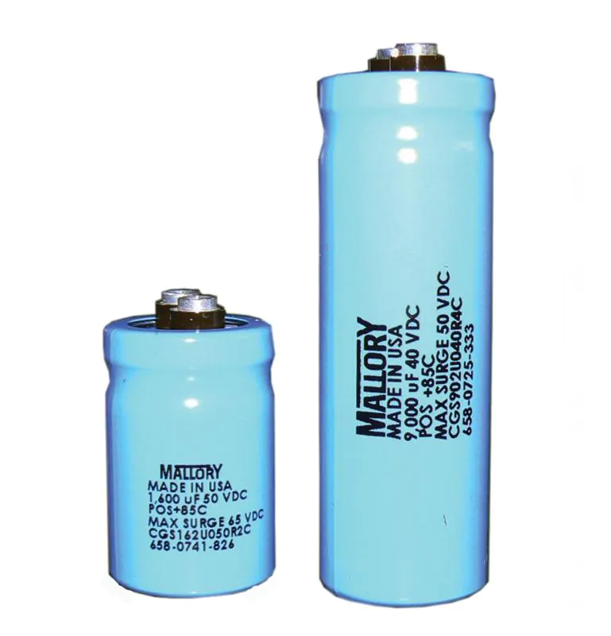

class: middle, center, title-slide
count: false

# Microgrids

Energy storage

  

Bertrand Cornélusse 
[bertrand.cornelusse@uliege.be](mailto:bertrand.cornelusse@uliege.be)

---

# What we will do in this lecture

We will review the main storage techgnologies and get an overview of their main properties.

The focus on energy storage technologies, management, and conversion requirements: 
 - short electrochemistry and physical analysis 
 - mostly how specific characteristics of each particular technology
affect microgrid design, planning, and operation.

---

# Introduction

A storage system is an object or device allowing to capture energy at a given point in time and restore some of it at a later time.

Ideally, the amount of energy restored should be as close as possible to the amount of energy captured initially, the ratio of the two defining the efficiency of the system.  

Sources and forms of energy vary widely, leading to the emergence of many different storage system technologies. 

---

## Currently available technology

- Batteries
- Capacitors
- Supercapacitors
- SMES (super conducting magnetic energy storage)
- Fuel cells
- Flywheels
- Compressed Air Storage
- Pumped Hydro-Power
- Pumped Heat Storage

---

## Power delivery vs energy delivery

.center.width-60[]

High power/energy ratio required to compensate lack of dynamics for load and generation following.

---

## Physical constitution of a battery

 - Electrodes: cathode  and anode
  - cathode: from where conventional current (+ charges) leaves -> + electrode *if* generator.
 - Electrolyte
 - case / enclosure

Voltage and current rating are function of material and construction.

The surface area of each cell determines factors such as 
 - the total energy stored, 
 - the maximum rates of charge and discharge

Example: standard 12V lead-acid battery: six 2V cells in series within an enclosure, that is either vented or sealed; the electrolyte can be a liquid or a gel.

---

class: middle, center

# Lead-acid batteries

---

## Composition

 - Lead $Pb$ (negative electrode)
 - Lead dioxide $PbO\_2$ (positive electrode)
 - Sulfuric acid $H\_2SO\_4$ and water in the electrolyte
 
Chemical reactions in the next video.

---

class: middle, center, black-slide

<iframe width="600" height="450" src="https://www.youtube.com/embed/rhIRD5YVNbs" frameborder="0" allowfullscreen></iframe>

---

## What limits the cycle-life?

During discharge, both electrode reactions create PbSo4 (*lead sulphate*) that coats the electrodes
- Lead sulphate is not totally removed when charging
- it accumulates with cycles

Sulfuric acid concentration dereases (as a consequence of the above phenomenon)
 - *flooded* lead-acid batteries can be replenished 
 - *sealed* lead-acid batteries cannot

To avoid accelerating the sulfation process, batteries need to be fully charged after every discharge and they must be kept
charged at a float voltage higher than the nominal voltage (2V). 

---

## Nernst equation recap

The relationship between battery-stored energy or capacity and electrolyte solution
concentration is given by Nernst equation

$$E = E^0 + \frac{kT}{q} \ln(Q)$$

- $E^0$ is the energy at a standard 1 molar concentration
- $k$ is the Boltzmann constant, 
- $T$ is the temperature in kelvin
- $q$ is the charge of an electron. 

Stored energy is heavily dependent not only on the molar concentration but also on the temperature.

---

## Efficiency

The overal efficiency
$$\eta = \eta\_V \eta\_C$$
is the product of 
- a voltage efficiency, ratio of the charge and discharge voltages, and technology dependent (VRLA = 88%)
- a coulombic efficiency, usually 92 %

---

## Efficiency varies with usage

Battery capacity is indicated in Ah (ampere-hour) (or Wh) for a given
discharge rate, which at full capacity is often 8 or 10 hours. 

The  internal resistance typically varies with different discharge rates, hence the capacity is less if the
battery is discharged faster (Peukert’s Effect).

---

## Efficiency and technologies, from [Victron's website](https://www.victronenergy.com/upload/documents/Datasheet-GEL-and-AGM-Batteries-EN.pdf): 

1. VRLA technology: stands for Valve Regulated Lead Acid, which means that the batteries are sealed. Gas will escape through the safety valves only in case of overcharging or cell failure. VRLA batteries are maintenance free for life.
2. Sealed (VRLA) AGM Batteries: AGM stands for Absorbent Glass Mat. In these batteries the electrolyte is absorbed into a glass-fibre mat between the plates by capillary action. (...) more suitable for short-time delivery of high currents than gel batteries.
3. Sealed (VRLA) Gel Batteries:  the electrolyte is immobilized as gel. Gel batteries in general have a longer service life and better cycle capacity than AGM
batteries.

---

class: middle, center

.center.width-80[]

---

class: middle, center

# Lithium Ion batteries

---

Lithium-ion (Li-ion) batteries have many advantages over lead-acid batteries:

1. Lighter than lead-acid batteries because lithium and carbon are lighter than lead.
2. Do not build up deposits every charge/discharge cycle, so their efficiency is about
99% -> cycle-life much bigger
3. Allow deeper discharges (although cycle-life dependes on DoD) 

Also, higher cell voltage means fewer series-connected cells for a same string voltage.

---

class: middle, center, black-slide

<iframe width="600" height="450" src="https://www.youtube.com/embed/VxMM4g2Sk8U" frameborder="0" allowfullscreen></iframe>

---

class: middle, center, black-slide

<iframe width="600" height="450" src="https://www.youtube.com/embed/PVnQ87Fvsk4" frameborder="0" allowfullscreen></iframe>
Do it yourself

---

class: middle, center, black-slide

<iframe width="600" height="450" src="https://www.youtube.com/embed/Rp8Hspi4BC4" frameborder="0" allowfullscreen></iframe>

---

## Battery Management System

- Modern battery storage systems are equipped with a battery management system (BMS).
- The BMS serves two main purposes:
 - Monitoring: harvest data to be fed to control systems and graphical user interface.
 - Safety: ensure battery does not operate in dangerous regimes, e.g. severe overvoltage or high temperature. Cell balancing.
- Old BMSs used inaccurate heuristics to estimate operating parameters and stop operation if needed whereas new generations exploit - high-fidelity electrochemical models solved in real-time.

---

## Comparison of Li-Ion Battery Technologies

.center.width-100[]

[Victron's lithium batteries](https://www.victronenergy.com/upload/documents/Datasheet-12,8-&-25,6-Volt-lithium-iron-phosphate-batteries-Smart-EN.pdf)

---

class: middle, center,

# Flow batteries

---

class: middle, center, black-slide

<iframe width="600" height="450" src="https://www.youtube.com/embed/AagO07cHRG8" frameborder="0" allowfullscreen></iframe>

Don't do it yourself ;)

---

class: middle, center, black-slide

<iframe width="600" height="450" src="https://www.youtube.com/embed/UT8vjThfWB4" frameborder="0" allowfullscreen></iframe>
What is vanadium (with Barack Obama!)

---

class: middle, center, black-slide

<iframe width="600" height="450" src="https://www.youtube.com/embed/eUlSPeF-b3g" frameborder="0" allowfullscreen></iframe>
Other chemistries under development.

---

class: middle, center
# Essential Battery Parameters

---
## Capacity, SOC & Voltage

- Capacity reflects total amount of charge (Ah) that can be theoretically stored in device.
- State of charge (SOC) reflects amount of charge available at given time instant, usually expressed as percentage of capacity.
- Voltage (V) at cell/pack terminals is measurable operating parameter providing indirect information about SOC. 

.center.width-60[]

---

## Current & C-rate

- Current (A) is the main excitation signal in batteries as voltage is imposed by system physics.
- C-rate is a standardized metric quantifying applied current intensity. This alternative scale is derived from the constant current intensity needed to fully charge/discharge the battery over a given time period, usually 1h.
- Battery charge/discharge behaviors vastly differ across C-rate range. 
- In particular, in Li-ion cells, much less charge can be retrieved from discharge at high C-rates. This phenomenon is called the rate - capacity effect.

---

## Degradation & Health

- Battery performances typically decrease over lifetime, in a process known as degradation.
- Main degradation types:
 - Power fade: peak power decreases over time.
 - Capacity fade: capacity decreases over time.
- Several metrics quantifying degradation exist, e.g. remaining capacity or internal resistance. Those quantities then allow to define state of health indicator in fashion similar to SOC. 

---

## Battery models in practice

Highly dependent of the application : 
- for sizing or planning problems, a simple tank model may be enough (for sizing, see how to evaluate capacity degradation on the next slide)
- a more detailed model can represent the current-voltage dependance and thus the efficiency as a function of the power charged or discharged: 

.center.width-80[]

---

## Simple model of energy capacity degradation as a function of the number of cycles

For Li-ion batteries, a simple throughput model is in general enough to evaluate the number of cycles:

cycles(t) = amount of Ah charged(t) / initial_capacity

Actual capacity(t) = initial capacity - $a$ * cycles(t)

$a$ is a parameter determined experimentally.

---

## Charging strategies

Charging strategies refer to the way current and voltage are controled over time to charge a battery.

Complex strategies exist to maximize the efficiency and the safety of the process

 - constant current CC is the simplest, but can lead to over voltage if not stopped fast enough
 - constant voltage CV is a bit more complex, but avoids over-voltages (since it is regulated). But leads to high currents when the battery is near empty and tiny currents when it is almost charged.
 - more advanced techniques combining CC and CV or regulating a function of C and improve the process.

---

## State of charge estimation

 - Coulomb counting
 - Voltage measurment
 - Kalman filtering
 - Technology specific methods.

---

class: middle, center

# Capacitors and supercapacitors

---

## Capacitors 

- Energy stored in electrostatic form (electrical field).
- Charge (electrons) stored on electrode surfaces.
- Dielectric inserted between electrodes to increase capacity.
- Two common designs: ceramic/film capacitors and electrolytic capacitors (with much higher capacity). 

---

## Schematic of common capacitor technologies 

.center.width-60[]

---

## Supercapacitors 

- Super and ultra capacitors are synonyms. Capacitors and super capacitors are different. 
- Energy stored in electrostatic form (electrical field).
- Charge (ions) adsorbed on porous activated carbon electrode surfaces bound to current collector.
- Ions transferred through electrolyte from one electrode to the other.
- Porous separator inserted between electrodes. 

---

## Schematic & working principle of super capacitor technology

.center.width-50[]

---

## E.g. Maxwell ultracapacitors

.center.width-90[]
[Description](https://www.maxwell.com/products/ultracapacitors/cells#18)

---

## Size comparison

.grid[
.kol-1-2[.center.width-100[] Capacitor of 1F: cylinder with
- diameter = 7.6 cm 
- length = 14.3 cm]
.kol-1-2[.center.width-10[] Ultracapacitor of *3*F: cylinder with
- diameter = 0.8 cm 
- length = 2cm]
]
---

???

# Comparison of the main battery types

For lead-acid and LiFePO4, Vanadium redox

Cell voltage
Specific energy (Wh/kg)
Specific power (W/kg)
Maximum cycles
Max DoD
Discharge time range
Cost (EUR/kWh)
Efficiency

---

# References

- Kwasinski, Alexis, Wayne Weaver, and Robert S. Balog. Microgrids and other local area power and energy systems. Cambridge University Press, 2016.

---

class: end-slide, center
count: false

The end.
